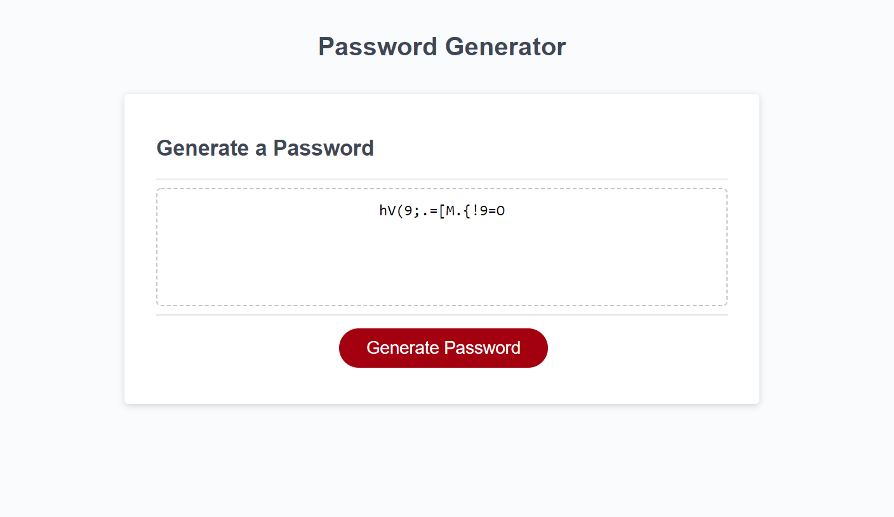

# hw-assign-03_password-generator
Homework Assignment Week 3 : Password  Generator

## User Story

```
AS AN employee with access to sensitive data
I WANT to randomly generate a password that meets certain criteria
SO THAT I can create a strong password that provides greater security
```

## Acceptance Criteria

```
GIVEN I need a new, secure password
WHEN I click the button to generate a password
THEN I am presented with a series of prompts for password criteria
WHEN prompted for password criteria
THEN I select which criteria to include in the password
WHEN prompted for the length of the password
THEN I choose a length of at least 8 characters and no more than 128 characters
WHEN prompted for character types to include in the password
THEN I choose lowercase, uppercase, numeric, and/or special characters
WHEN I answer each prompt
THEN my input should be validated and at least one character type should be selected
WHEN all prompts are answered
THEN a password is generated that matches the selected criteria
WHEN the password is generated
THEN the password is either displayed in an alert or written to the page
```


## Description

The Password Generator application can be used to generate a random password based on user selected criteria. This app runs in the browser, and has a clean and polished user interface that is responsive, ensuring that it adapts to multiple screen sizes.
The user can generate a new, secure and random password, but with the following criteria:
- Password length should be a number between 8-128 characters (both inclusive).
- Password should include at least one of lowercase, uppercase, numbers or special characters.

The application handles input validations that would ensure that the above criteria is met.

The special characters that are used to generate the password can be found here.
[list of Password Special Characters from the OWASP Foundation](https://www.owasp.org/index.php/Password_special_characters).


## For Review

* Deployed Application URL: https://jesaldm.github.io/hw-assign-03_password-generator/.
* Github Repository URL: https://github.com/JesalDM/hw-assign-03_password-generator
* Screenshot: 
